# 🖐️ ESP32 Gesture Controller over MQTT

A complete end-to-end system for controlling hardware devices through hand gestures detected via computer vision.

  

## 📖 Overview

This is a comprehensive system that uses your webcam to detect hand gestures and control physical devices in real-time. The system uses **MediaPipe** for hand tracking, **MQTT** for communication, and can power servo motors and LED indicators based on simple hand gestures.

**Perfect for:**
- Home automation projects
- Interactive exhibits
- Educational robotics
- Accessibility solutions
- IoT applications

With a clean, user-friendly web interface, the project is suitable for beginners and experienced developers alike.

## ✨ Features

- **Real-time hand gesture detection** - Open/closed hand recognition with MediaPipe
- **Web-based control interface** - Configure settings and monitor in real-time
- **MQTT communication** - Industry-standard messaging for IoT devices
- **Physical device control** - Control servos, LEDs, and other hardware
- **Cross-platform compatibility** - Runs on Windows, macOS, and Linux
- **Responsive UI** - Works on desktops, tablets, and mobile devices

## 🖼️ Screenshots

> 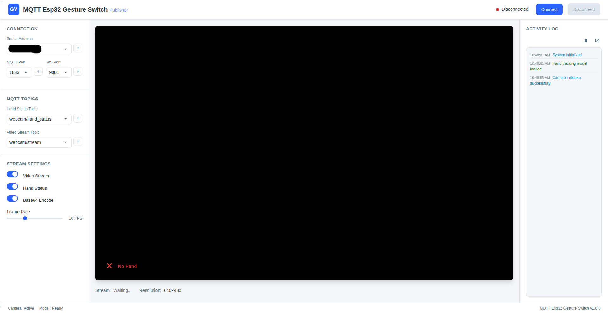

## 🔧 System Requirements

- Computer with a webcam
- ESP32 development board
- Servo motor (I used the [SG90 Servo Motor](https://techshopbd.com/detail/659/Servo_Motor_SG90_techshop_bangladesh))
- MQTT broker (e.g., Mosquitto)
- Modern web browser (for web interface)

## 🛠️ Installation & Setup

### 1. Set Up MQTT Broker

#### Ubuntu
1. Install mosquitto
```bash
sudo apt update
sudo apt install mosquitto mosquitto-clients
sudo systemctl enable mosquitto
sudo systemctl start mosquitto
```
2. Configure mosquitto.conf
```bash
sudo nano /etc/mosquitto/mosquitto.conf
```
   - Then add the following lines, save and exit (`ctrl+x > y > Enter`)
```bash
listener 1883
protocol mqtt

listener 9001
protocol websockets
```
3. Restart the service:
```bash
sudo systemctl restart mosquitto
```

#### Windows
1. Download the [Mosquitto installer](https://mosquitto.org/download/)
2. Run the installer and follow the setup wizard
3. Configure mosquitto.conf
Navigate to `C:\Program Files\mosquitto\mosquitto.conf` and add:
```bash
listener 1883
protocol mqtt

listener 9001
protocol websockets
```
4. Open Command Prompt as administrator and run:
```
net start mosquitto
```

#### macOS
1. Install and start mosquitto
```bash
brew install mosquitto
brew services start mosquitto
```
2. Configure mosquitto.conf
```bash
nano /usr/local/etc/mosquitto/mosquitto.conf
```
3. Restart service:
```bash
brew services restart mosquitto
```

### 2. Web Interface Setup (Main Application)

1. Clone this repository or download the files
2. Make sure you have the following files in a directory:
   - `index.html`
   - `style.css`
   - `publisher.js`
3. Open `index.html` in a modern web browser
4. Allow camera access when prompted
5. Use the interface to connect to your MQTT broker

### 3. Python Implementation (For Testing & Development Only)

> **Note:** The Python implementation is primarily intended for testing purposes and future development. The web interface is the recommended way to use this project.

#### Install Dependencies
```bash
pip install paho-mqtt opencv-python mediapipe numpy
```

#### Running the Python Publisher (For testing only)
```bash
python video_publisher.py
```

#### Running the Python Subscriber (For testing only)
```bash
python video_subscriber.py
```

### 4. ESP32 Setup

<div style="background-color: #fff3cd; color:rgb(107, 79, 2); padding: 12px; border-left: 5px solid #ffeeba; border-radius: 4px; font-weight: bold; font-size: 16px;">
⚠️ If your <strong>Arduino IDE</strong> is already installed and set up for the <strong>ESP32 board</strong>, you can <u>skip Step 1 and Step 2</u>, and start from <u>Step 3</u>.
</div>
<br>

1. Install **[Arduino IDE](https://support.arduino.cc/hc/en-us/articles/360019833020-Download-and-install-Arduino-IDE)**
2. Add ESP32 board support in Arduino IDE:
   - Go to `File > Preferences`
   > 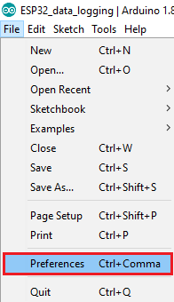

   - Add `https://raw.githubusercontent.com/espressif/arduino-esp32/gh-pages/package_esp32_index.json` to Additional Board Manager URLs
   > 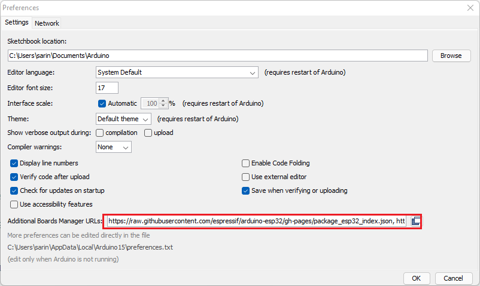

   - Go to `Tools > Board > Boards Manager` and install ESP32
   > 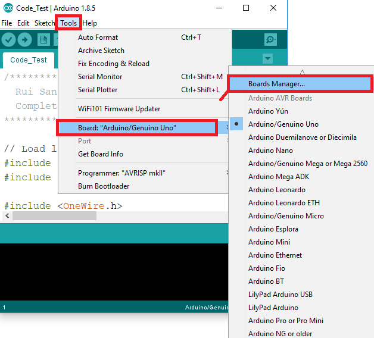
   > 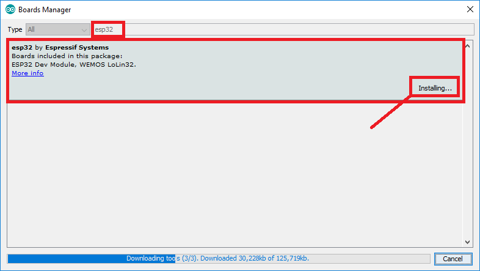

   - Go to `Tools > Board > ESP32 Ardiono` and select **ESP32 Wrover Module** (or your esp32 model)
   > 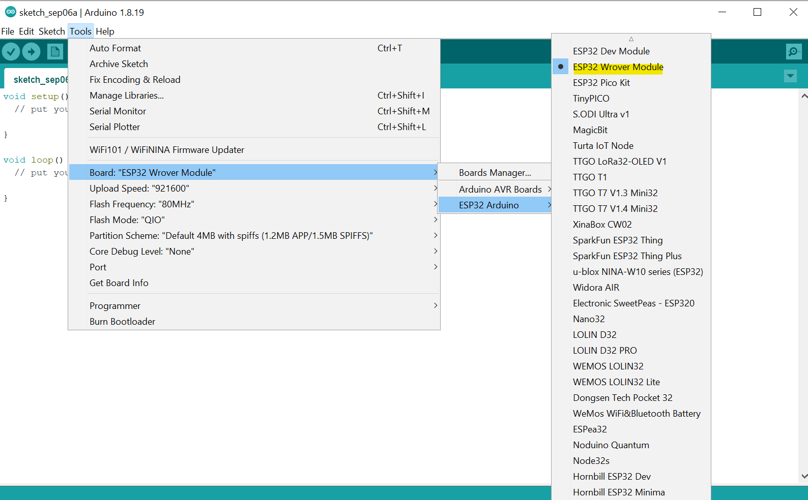

3. Install required libraries:
   - Go to `Sketch > Include Library > Manage Libraries`
   > 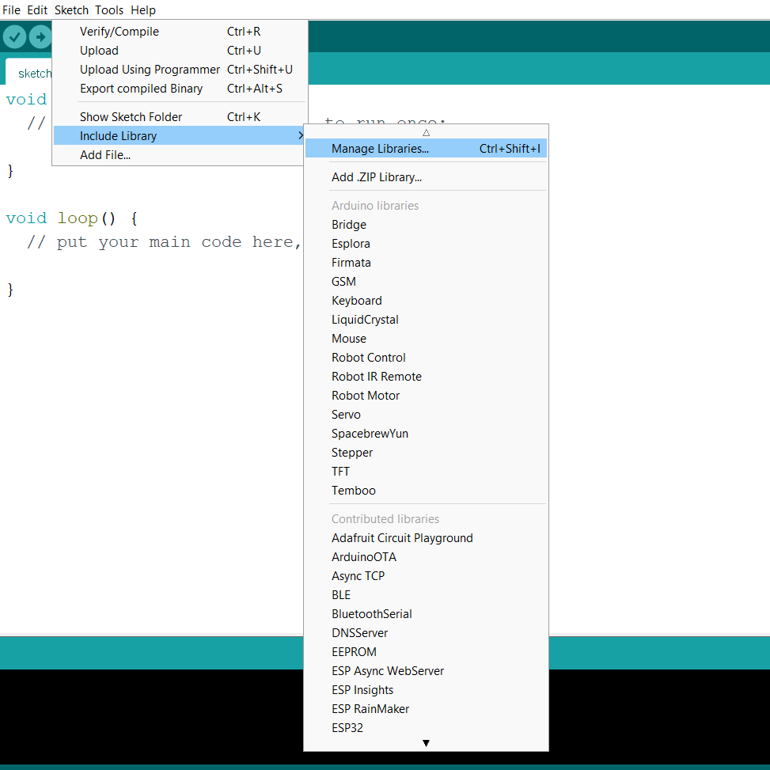

   - Install `PubSubClient` and `ESP32Servo`
   > 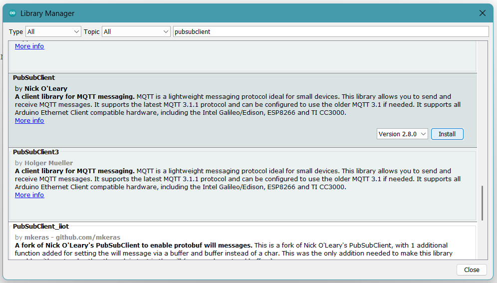
   > 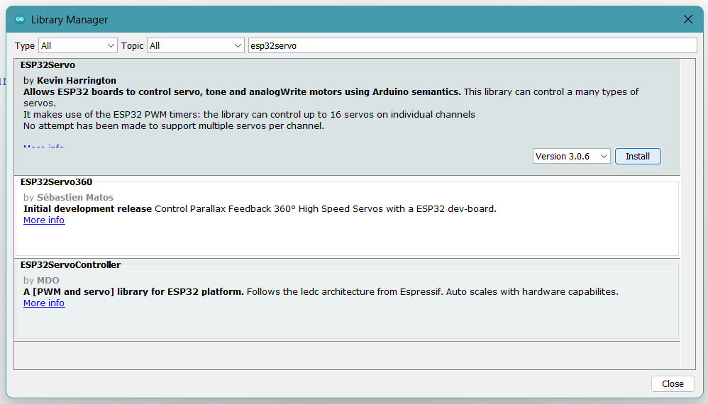
   
4. Open `/esp32_code/gesture_command_receiver_servo.ino`
5. Update WiFi credentials and MQTT broker address
```cpp
// Wi-Fi Credentials
const char* ssid = "SSID"; // Your Wi-Fi SSID
const char* password = "PASSWORD"; // Your Wi-Fi Password

// MQTT Broker
const char* mqtt_server = "192.168.2.254"; // Your MQTT Broker IP address
// MQTT Topic
const char* topic = "webcam/hand_status";
```
6. Connect ESP32 to your computer and select port from `Tools > Port`
7. Upload sketch to ESP32

## 🔌 Hardware Connections

### ESP32 to Servo Motor

> 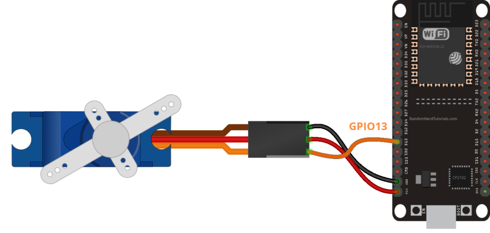

**Image Source:** [https://randomnerdtutorials.com/esp32-servo-motor-web-server-arduino-ide/](https://randomnerdtutorials.com/esp32-servo-motor-web-server-arduino-ide/)

- Servo signal wire → ESP32 pin 13
- Servo power (red) → 5V or external power supply
- Servo ground (brown/black) → GND

### ESP32 LED Indicator

> 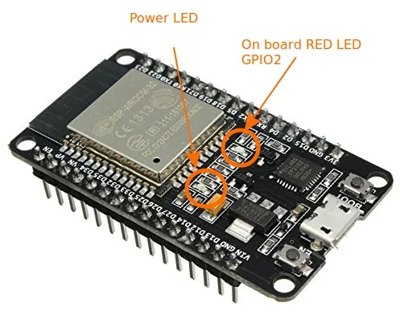

**Image Source:** [https://circuits4you.com/2018/02/02/esp32-led-blink-example/](https://circuits4you.com/2018/02/02/esp32-led-blink-example/)

- Built-in LED on pin 2 is used by default

## 🚀 Usage

1. Start your MQTT broker ([Check Installation & Setup](#🛠️-installation--setup))
2. Power up your ESP32 with the servo connected
3. Launch the **web interface** by opening `/web_interface/index.html` in your browser (this is the main application)
4. Set your credentials and connect
5. Make hand gestures in front of the camera:
   - Open hand → Servo rotates to 90 degrees, LED off
   - Closed hand (fist) → Servo rotates to 0 degrees, LED on

> 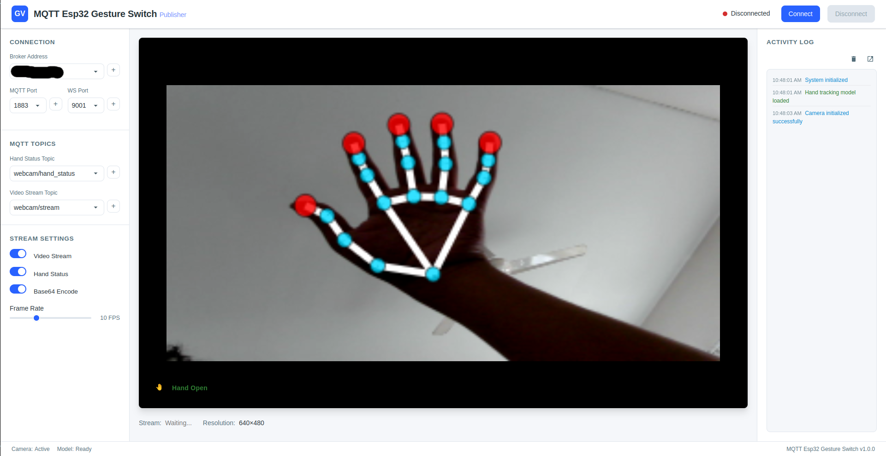
> 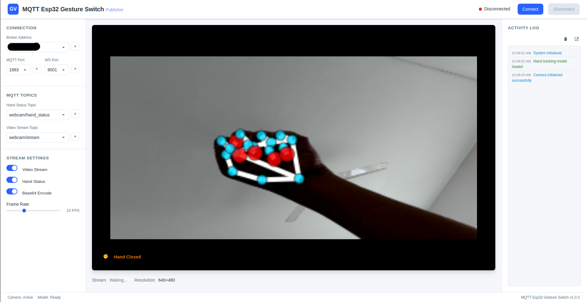

6. This web app also publishes the video stream at the topic `webcam/stream` and the user can turn this on / off, set the frame rate and control how the video stream is sent:
   - **✅ Base64 Enabled:** The video frame (JPEG image) is encoded as a Base64 string, and then sent as text over MQTT
   - **⬜ Base64 Disabled:** The video frame is sent as raw binary data (bytes) over MQTT, without encoding

## 📊 How It Works

1. **Hand Detection**: MediaPipe tracks hand landmarks in video frames
2. **Gesture Classification**: System determines if hand is open or closed
3. **MQTT Publishing**: Gesture status is published to MQTT topic
4. **IoT Control**: ESP32 subscribes to MQTT topic and controls servos and LEDs

## 🔄 Custom Gestures

The base system detects open and closed hands, but you can extend it with custom gestures:

1. Modify the gesture detection algorithm in `publisher.js` 
2. Update the ESP32 response in `gesture_command_receiver_servo.ino`

## 🔍 Troubleshooting

### Camera Not Working
- Ensure your browser has permission to access the camera
- Try another USB port if using an external webcam
- Check if another application is using the camera

### MQTT Connection Issues
- Verify **broker address** and **port**
   - For the web app, go to `/web_interface/publisher.js` and adjust default IP
   > 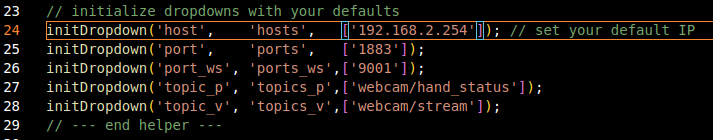
   - Using the web app, you can simply add your broker IP in the **web interface**
   
- Check network connectivity
- Ensure firewall allows MQTT traffic

### ESP32 Not Responding
- Check power supply
- Verify **serial output** for connection status
- Confirm **topic names** match between the web interface and ESP32

## 🌟 Project Ideas

- **Robotic Hand Mirroring**: Create a robotic hand that follows your hand movements
- **Smart Home Control**: Open hand to turn on lights, closed hand to turn them off
- **Drone Navigation**: Control drone direction with hand gestures
- **Media Control**: Change volume, play/pause with simple gestures
- **Security System**: Wave to a camera to unlock a door

## 🔮 Future Improvements

- Add more gesture types (pointing, pinch, thumbs up, etc.)
- Implement two-hand detection for more complex controls
- Use the `Gesture Recognizer` task in Mediapipe's `Tasks` API that runs on a pre-trained model bundle and yields high-level gesture categories in real time
- Add machine learning for custom gesture training
- Create mobile app companion
- Add voice command integration
- Integrate with additional hardware for specific applications
- Expand the Python implementation for advanced computer vision capabilities

## 📚 File Overview

- `index.html` - Main web interface structure
- `style.css` - Web interface styling
- `publisher.js` - JavaScript hand tracking and MQTT publishing (primary implementation)
- `video_publisher.py` - Python alternative for hand tracking and publishing (for testing/development)
- `video_subscriber.py` - Python script for receiving and displaying video stream (for testing)
- `gesture_command_receiver_servo.ino` - Arduino sketch for ESP32

## 🧩 Contributing

Contributions are welcome! Feel free to:
- Report bugs
- Suggest features and improvements

## 📄 License

This project is licensed under the MIT License - see the LICENSE file for details.

## 🙏 Acknowledgments

- [MediaPipe](https://mediapipe.dev/) - Hand tracking solution
- [Paho MQTT](https://www.eclipse.org/paho/) - MQTT client libraries
- [MQTT Webapp](https://github.com/HighVoltages/MQTTwebapp) - Instructions for importing the paho mqtt library for javascript
- [OpenCV](https://opencv.org/) - Computer vision library
- [Random Nerd Tutorials](https://randomnerdtutorials.com/) - Initial setup instructions and images
- [ChatGPT](https://chatgpt.com/) - UI & Documentation Improvement
